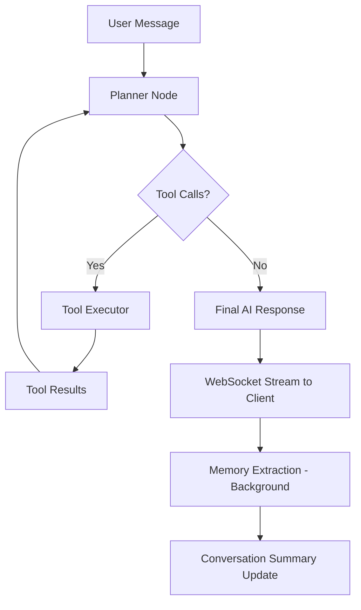

<div align="center">

# 🤖 Agentic AI Chatbot

### An Intelligent, Tool-Augmented Conversational AI Platform

[](https://python.org)
[](https://fastapi.tiangolo.com)
[](https://reactjs.org)
[](https://typescriptlang.org)
[](https://langchain-ai.github.io/langgraph/)
[](https://groq.com)

*A full-stack agentic chatbot that autonomously plans, selects, and executes tools — powered by LangGraph's cyclic agent architecture, Groq LLMs, and real-time WebSocket streaming.*

---

**Built by [Anshul Katiyar](https://github.com/AnshulKatiyar)**

</div>

---

## 📌 Overview

This project is a **production-grade, agentic AI chatbot** that goes beyond simple Q&A. It leverages a **LangGraph state machine** to autonomously reason about user queries, decide which tools to invoke, execute them, and synthesize responses — all in real time via WebSocket streaming.

The system features a **Planner ↔ Tool Executor loop** — the LLM plans actions, calls tools (weather, web search, news, email, RAG), observes results, and iterates until a final answer is produced. It also includes a **persistent memory system** that remembers user preferences across sessions for personalized interactions.

---

## ✨ Key Features

| Feature | Description |
|---|---|
| 🧠 **Agentic Reasoning** | LangGraph-powered cyclic planner → tool executor → planner loop with conditional routing |
| 🔧 **8 Built-in Tools** | Weather, Web Search, News, Email (draft/edit/send/cancel), RAG Document Q&A |
| 📄 **RAG Pipeline** | Upload PDFs/TXT/MD → chunk → embed (HuggingFace) → ChromaDB vector store → similarity search |
| 💬 **Real-time Streaming** | WebSocket-based word-by-word response streaming for a fluid chat UX |
| 🧑 **User Memory & Personalization** | LLM-extracted personal facts (name, location, preferences) persisted in SQLite for cross-session recall |
| 📧 **Email Workflow** | Full lifecycle: draft → review → edit → send/cancel via Gmail SMTP |
| 🗂️ **Multi-Session Management** | Create, switch, and delete independent chat sessions with full message history |
| 📝 **Auto-Generated Titles** | LLM generates concise session titles from the first message |
| 🛡️ **Smart Tool Gating** | Tools are shown/hidden from the LLM based on session context (e.g., RAG only after upload) |
| 📊 **Conversation Summarization** | Rolling memory summaries to maintain context beyond the token window |

---

## 🏗️ Architecture

```
┌─────────────────────────────────────────────────────────────────────┐
│                         FRONTEND (React + TypeScript + Vite)        │
│  ┌─────────────┐  ┌──────────────┐  ┌────────────┐  ┌───────────┐ │
│  │  Chat UI    │  │ File Upload  │  │  Session    │  │ Markdown  │ │
│  │  (WebSocket)│  │  (REST API)  │  │  Sidebar    │  │ Rendering │ │
│  └──────┬──────┘  └──────┬───────┘  └──────┬─────┘  └───────────┘ │
└─────────┼────────────────┼─────────────────┼───────────────────────┘
          │ WS             │ HTTP            │ HTTP
┌─────────┴────────────────┴─────────────────┴───────────────────────┐
│                     BACKEND (FastAPI + Uvicorn)                     │
│                                                                     │
│  ┌────────────────────────────────────────────────────────────────┐ │
│  │                    LangGraph Agent Loop                        │ │
│  │                                                                │ │
│  │    ┌──────────┐    has tool calls?    ┌────────────────┐       │ │
│  │    │ Planner  │ ───── YES ──────────► │ Tool Executor  │       │ │
│  │    │ (LLM)    │ ◄──────────────────── │  (8 tools)     │       │ │
│  │    └────┬─────┘         NO            └────────────────┘       │ │
│  │         │                                                      │ │
│  │         ▼                                                      │ │
│  │    Final Response                                              │ │
│  └────────────────────────────────────────────────────────────────┘ │
│                                                                     │
│  ┌──────────────┐  ┌────────────────┐  ┌─────────────────────────┐ │
│  │  SQLite DB   │  │  ChromaDB      │  │  Memory Extractor       │ │
│  │  (Sessions,  │  │  (RAG Vectors, │  │  (LLM-based fact        │ │
│  │   Messages,  │  │   per-session  │  │   extraction &          │ │
│  │   Emails,    │  │   collections) │  │   personalization)      │ │
│  │   UserFacts) │  │                │  │                         │ │
│  └──────────────┘  └────────────────┘  └─────────────────────────┘ │
└─────────────────────────────────────────────────────────────────────┘
```

---

## 🔧 Tools

| Tool | Function | Description |
|---|---|---|
| 🌤️ `get_weather` | Weather lookup | Fetches current weather for any city via external API |
| 🔍 `search_web` | Web search | Performs real-time web search using DuckDuckGo |
| 📰 `fetch_news` | News headlines | Retrieves latest news articles on a given topic |
| 📄 `query_rag` | Document Q&A | Similarity search over uploaded documents (ChromaDB) |
| ✉️ `draft_email` | Email drafting | AI-assisted email composition with to/subject/body |
| ✏️ `edit_email` | Email editing | Modify a pending email draft |
| 📤 `send_email` | Email sending | Send the finalized email via Gmail SMTP |
| ❌ `cancel_email` | Email cancellation | Discard a pending email draft |

> Tools are **dynamically gated** — the LLM only sees `query_rag` after documents are uploaded, and email management tools only appear when a draft exists.

---

## 🛠️ Tech Stack

### Backend
| Technology | Role |
|---|---|
| **FastAPI** | Async REST API + WebSocket server |
| **LangGraph** | Agentic state machine (cyclic graph) |
| **LangChain Core** | LLM abstraction, tool binding, message types |
| **Groq (LLaMA)** | Ultra-fast LLM inference |
| **ChromaDB** | Vector database for RAG embeddings |
| **HuggingFace Transformers** | Sentence embeddings (`all-MiniLM-L6-v2`) |
| **SQLAlchemy + SQLite** | Relational storage for sessions, messages, emails, user facts |
| **PyPDF** | PDF text extraction for RAG ingestion |
| **DuckDuckGo Search** | Web search tool backend |

### Frontend
| Technology | Role |
|---|---|
| **React 18** | Component-based UI |
| **TypeScript** | Type-safe frontend logic |
| **Vite** | Lightning-fast dev server and bundler |
| **Tailwind CSS** | Utility-first styling |
| **React Markdown** | Renders AI responses with rich formatting |
| **React Syntax Highlighter** | Code block syntax highlighting in responses |

---

## 📁 Project Structure

```
Agentic_chatbot/
├── backend/
│   ├── app/
│   │   ├── agents/                 # LangGraph agent system
│   │   │   ├── graph.py            # StateGraph: planner ↔ tool_executor loop
│   │   │   ├── planner.py          # LLM planner node with dynamic system prompts
│   │   │   ├── tool_executor.py    # Executes tool calls from the LLM
│   │   │   ├── state.py            # AgentState TypedDict definition
│   │   │   ├── rag_store.py        # ChromaDB vector store (per-session collections)
│   │   │   ├── memory_agent.py     # Rolling conversation summarization
│   │   │   └── memory_extractor.py # LLM-based personal fact extraction
│   │   ├── tools/                  # Tool implementations
│   │   │   ├── registry.py         # Central tool registry (MCP-swappable design)
│   │   │   ├── schemas.py          # Pydantic input schemas for all tools
│   │   │   ├── weather.py          # Weather API integration
│   │   │   ├── web_search.py       # DuckDuckGo web search
│   │   │   ├── news.py             # News fetching
│   │   │   ├── email.py            # Gmail SMTP email workflow
│   │   │   └── rag.py              # RAG query tool
│   │   ├── main.py                 # FastAPI app, routes, WebSocket handler
│   │   ├── models.py               # SQLAlchemy ORM models
│   │   ├── schemas.py              # Pydantic response schemas
│   │   ├── db.py                   # Database engine & session factory
│   │   ├── llm.py                  # Groq LLM configuration
│   │   └── websocket_manager.py    # WebSocket connection manager
│   ├── requirements.txt
│   └── .env                        # API keys & configuration
├── frontend/
│   ├── src/
│   │   ├── App.tsx                 # Main chat application component
│   │   ├── main.tsx                # React entry point
│   │   ├── index.css               # Global styles
│   │   ├── services/               # API service layer
│   │   └── types/                  # TypeScript type definitions
│   ├── package.json
│   ├── vite.config.ts
│   └── tailwind.config.js
└── .gitignore
```

---

## 🚀 Getting Started

### Prerequisites

- **Python 3.11+**
- **Node.js 18+**
- **Groq API Key** — [Get one free at groq.com](https://console.groq.com)

### 1. Clone the Repository

```bash
git clone https://github.com/AnshulKatiyar/Agentic_chatbot.git
cd Agentic_chatbot
```

### 2. Backend Setup

```bash
cd backend

# Create and activate virtual environment
python -m venv venv
venv\Scripts\activate        # Windows
# source venv/bin/activate   # macOS/Linux

# Install dependencies
pip install -r requirements.txt

# Configure environment variables
# Create .env file with:
# GROQ_API_KEY=your_groq_api_key
# EMBEDDING_MODEL=sentence-transformers/all-MiniLM-L6-v2
# EMAIL_ADDRESS=your_email@gmail.com       (optional, for email tool)
# EMAIL_PASSWORD=your_app_password         (optional, for email tool)

# Start the server
uvicorn app.main:app --reload --port 8000
```

### 3. Frontend Setup

```bash
cd frontend

# Install dependencies
npm install

# Create .env file with:
# VITE_API_URL=http://localhost:8000

# Start the development server
npm run dev
```

### 4. Open the App

Navigate to `http://localhost:5173` in your browser.

---

## 💡 How It Works

### The Agentic Loop



1. **User sends a message** via WebSocket
2. **Planner** (Groq LLM) analyzes the message with conversation context, user facts, and available tools
3. If the LLM decides to use tools → **Tool Executor** runs them and returns results
4. Planner re-evaluates with tool results — may call more tools or produce a final answer
5. **Response streams** word-by-word to the frontend
6. **Background tasks** extract personal facts and update conversation summaries

### Memory & Personalization

The system maintains two types of memory:

- **Conversation Memory**: Rolling LLM-generated summaries that compress long conversations while retaining key context
- **User Facts**: Persistent personal details (name, location, preferences) extracted via LLM and stored in SQLite — used to personalize future interactions across all sessions

---

## 📋 API Endpoints

| Method | Endpoint | Description |
|---|---|---|
| `WS` | `/ws/chat/{session_id}` | WebSocket chat with real-time streaming |
| `POST` | `/sessions` | Create a new chat session |
| `GET` | `/sessions` | List all sessions (sorted by recent activity) |
| `GET` | `/sessions/{id}/messages` | Get message history for a session |
| `GET` | `/sessions/{id}/documents` | List uploaded documents for a session |
| `DELETE` | `/sessions/{id}` | Delete a session and all its data |
| `POST` | `/rag/upload` | Upload documents (PDF/TXT/MD) for RAG |
| `GET` | `/user/facts` | Retrieve all stored user facts |
| `DELETE` | `/user/facts/{key}` | Delete a specific user fact |

---

## 🔮 Future Enhancements

- [ ] **MCP Integration** — Tool registry is designed for MCP-swappable execution
- [ ] **Cloud Vector Store** — Migrate ChromaDB to MongoDB Atlas Vector Search or Pinecone
- [ ] **Multi-User Support** — User authentication and per-user fact isolation
- [ ] **Voice Input/Output** — Speech-to-text and text-to-speech integration
- [ ] **Agent Observability** — LangSmith tracing and tool execution dashboards
- [ ] **Streaming Tool Status** — Show tool execution progress in the UI

---

## 📄 License

This project is open-source and available under the [MIT License](LICENSE).

---

<div align="center">

**Built with ❤️ by Anshul Katiyar**

*If you found this project helpful, consider giving it a ⭐!*

</div>
